  <picture>
    <source media="(prefers-color-scheme: dark)" srcset="./assets/hero/builder-profile-dark.svg">
    <source media="(prefers-color-scheme: light)" srcset="./assets/hero/builder-profile-light.svg">
    
  </picture>

  <a href="https://xuscorp.com/founder"><strong>Portfolio</strong></a> ·
  <a href="mailto:ch.varun1309@gmail.com"><strong>Email</strong></a> ·
  <a href="https://linkedin.com/in/varun_chennuri"><strong>LinkedIn</strong></a> ·
  <a href="https://twitter.com/varun_chennuri"><strong>X</strong></a>

## Hey, I'm Varun

I'm an **AI product architect and full-stack builder** based in Hyderabad, India. I work across **AI agents, automotive dealer platforms, and developer tools** — shaping the product, designing the system, and writing the software behind it.

Right now I'm an **AI Product Architect at Cyepro Solutions**, building dealer-performance analytics and MIS dashboards for automotive dealerships. Before that I spent two years at **Genie AI** going from RPA engineering to AI research to product architecture.

## What I Build

- **AI products & agents:** tool-using assistants, agentic automation (n8n + RAG pipelines), and workflows that keep humans in control of the decisions.
- **Automotive dealer platforms:** CRM/DMS systems, multi-dealer KYC onboarding, funnel analytics (enquiry → test drive → booking → retail), and WhatsApp Business integrations.
- **Developer tools:** memory layers for AI coding agents, testable CLI utilities, and governed automation.
- **Privacy-first software:** self-hosted apps where the user owns the infrastructure and the data.

## Selected Work

| Project | What I built | Current state |
| --- | --- | --- |
| [**Ledgerly**](https://github.com/chennurivarun/ledgerly) | Private, self-hosted personal finance that runs entirely on your own Cloudflare account — D1, R2, and Workers. AGPL-3.0. | v0.2.0 released — "the Open Bank-Format Commons" |
| [**ClaimGuard**](https://github.com/chennurivarun/claim-guard-repair-benchmarking) | UK motor-repair invoice extraction and governed repair-cost benchmarking — LLM extraction with auditable checks instead of blind trust. | Active prototype, in daily development |
| [**Infinite Context**](https://github.com/chennurivarun/infinite-context) | Turns Obsidian into a persistent memory layer for Claude Code — parallel agents with shared context and minimal token waste. | Open source |
| [**Humanonly**](https://github.com/chennurivarun/Humanonly) | Open-source social platform for authentic human expression — AI-managed operations, human-governed decisions. | Early open source |
| [**alarmclock-cli**](https://github.com/chennurivarun/alarmclock-cli) | Dependency-free Python CLI alarm clock — pure scheduling core with injected clock/sound/storage for fast, deterministic tests. | Complete |

## Experience Highlights

- **AI Product Architect · Cyepro Solutions** (Dec 2025 – present): dealer-performance MIS dashboards, funnel analytics, CRM/DMS data architecture, and automated stakeholder reporting for automotive retail.
- **Freelance AI Product Architect** (Jun – Nov 2025): end-to-end dealership CRM + B2B marketplace — multi-dealer KYC (GST/PAN/OTP), stock and booking management, WhatsApp Business and voice automation, agentic workflows with n8n + ChromaDB.
- **Genie AI, Canada (remote)** (2023 – 2025): grew from RPA Engineer to AI Researcher to AI Product Architect — Python automation, product flows, and AI tool design.
- **Founder · Checkmatics:** AI product intelligence for personalized health — ingredient scanning and smart alternatives.
- **Published research:** *"AI-Based Voice Assistants Using Large Language Models."*
- **Technical & Design Lead · Google Developer Students Club** (2021 – 2022): 10+ technical talks, mentored 10+ students.

## What I'm Exploring

I'm interested in **governed AI** — agents that can operate real business systems (finance, insurance, dealerships) with audit trails and human oversight built in, not bolted on. Extraction you can verify, automation you can trust, and memory that persists.

## Tools I Use

`Python` · `TypeScript` · `Next.js` · `React` · `Node.js` · `Supabase` · `PostgreSQL` · `Cloudflare Workers` · `LangChain` · `TensorFlow` · `PyTorch` · `OpenCV` · `n8n` · `Docker`

## Contribution Trail

  <picture>
    <source media="(prefers-color-scheme: dark)" srcset="https://raw.githubusercontent.com/chennurivarun/chennurivarun/output/github-contribution-grid-snake-dark.svg">
    <source media="(prefers-color-scheme: light)" srcset="https://raw.githubusercontent.com/chennurivarun/chennurivarun/output/github-contribution-grid-snake.svg">
    
  </picture>

<strong>Recent public activity</strong>

 

<!-- AUTO:ACTIVITY:START -->
- Aug 26, 2026: pushed commits to [chennurivarun/claim-guard-repair-benchmarking](https://github.com/chennurivarun/claim-guard-repair-benchmarking).
- Aug 24, 2026: published release [Ledgerly v0.2.0 — the Open Bank-Format Commons](https://github.com/chennurivarun/ledgerly/releases/tag/v0.2.0).
- Aug 23, 2026: pushed commits to [chennurivarun/claim-guard-repair-benchmarking](https://github.com/chennurivarun/claim-guard-repair-benchmarking).
<!-- AUTO:ACTIVITY:END -->

---

  Building AI products that work with real systems — and stay accountable to the humans using them.

