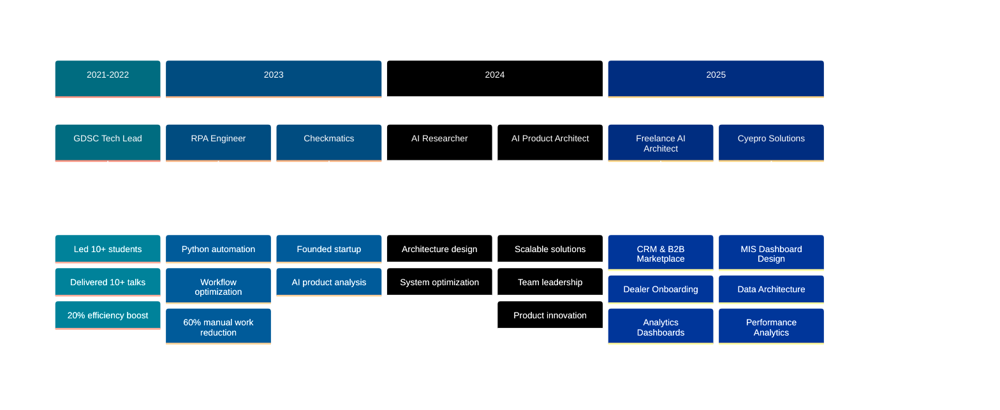

<div align="center">


<!-- Animated Name with Glitch Effect -->
<h1>
  
</h1>

<!-- Coding Animation GIF -->


<!-- Stylish Subtitle with Icons -->
<h3>
  
  Building the Future of AI, One Innovation at a Time
  
</h3>

<!-- Multi-line Typing Effect -->
<a href="https://git.io/typing-svg">
  
</a>

<br>

<!-- Quick Access Buttons with Gradient Style -->
<p>
  <a href="https://xuscorp.com/founder">
    
  </a>
  <a href="https://github.com/chennurivarun/chennurivarun/blob/main/varun_chennuri_resume.pdf">
    
  </a>
  <a href="mailto:ch.varun1309@gmail.com">
    
  </a>
</p>

<!-- Enhanced Social & Professional Links -->
<table>
<tr>
<td align="center" width="20%">
  <a href="https://linkedin.com/in/varun_chennuri">
    
  </a>
</td>
<td align="center" width="20%">
  <a href="https://github.com/chennurivarun">
    
  </a>
</td>
<td align="center" width="20%">
  <a href="https://twitter.com/varun_chennuri">
    
  </a>
</td>
<td align="center" width="20%">
  <a href="https://xuscorp.com/founder">
    
  </a>
</td>
<td align="center" width="20%">
  <a href="mailto:ch.varun1309@gmail.com">
    
  </a>
</td>
</tr>
</table>

<!-- Stats Row with Modern Badges -->
<p>
  
  
  
  
</p>

<!-- Animated Separator -->


</div>

---

<!-- Two-Column Layout: Profile + Quick Stats -->
<table>
<tr>
<td width="55%" valign="top">

##  About Me

```yaml
name: Varun Chennuri
title: AI Product Architect
company: Cyepro Solutions
location: Hyderabad, Telangana, India 🇮🇳
contact: +91-9390221962

professional_links:
  portfolio: "https://xuscorp.com/founder"
  resume: "Available for Download ↗️"
  email: "ch.varun1309@gmail.com"

experience:
  current_role: "AI Product Architect @ Cyepro Solutions"
  years: "4+ Years in AI/ML/RPA/Product Architecture"
  specializations:
    - Large Language Models (GPT-3.5, LangChain)
    - Computer Vision & Deep Learning
    - Robotic Process Automation
    - Product Architecture & Design
    - AI-Driven Automation Systems
    - CRM & B2B Marketplace Development
    - Analytics & MIS Dashboard Design

current_focus:
  primary: "Dealer Performance Analytics & MIS Dashboards 📊"
  secondary: "Video Generation from Prompts 🎬"
  tertiary: "ASL to Speech Converter 🗣️"
  research: "LLM Applications & Prompt Engineering"
  startup: "Checkmatics - AI Product Intelligence"

philosophy: |
  "Innovation is intelligence having fun!
   Building AI solutions that transform industries
   and enhance human productivity." 🚀

open_to:
  - "AI/ML Full-time Opportunities"
  - "Collaborative Research Projects"
  - "Startup Innovation & Consulting"
  - "Speaking Engagements & Mentorship"
```

</td>
<td width="45%" valign="top">

##  Quick Highlights

<div align="center">

### 🎯 Impact Metrics

<table>
<tr>
<td align="center" width="50%">

<br><b>20+</b>
<br><sub>AI Projects Deployed</sub>
</td>
<td align="center" width="50%">

<br><b>15+</b>
<br><sub>Teams Led & Mentored</sub>
</td>
</tr>
<tr>
<td align="center" width="50%">

<br><b>Published</b>
<br><sub>Research Papers</sub>
</td>
<td align="center" width="50%">

<br><b>5+</b>
<br><sub>Certifications</sub>
</td>
</tr>
</table>

### 📊 Activity Overview


### 🏆 Achievement Unlocked


</div>

</td>
</tr>
</table>

<!-- Animated Separator -->


---

<!-- Professional Journey Timeline -->
<h2 align="center">
  
  Professional Journey
  
</h2>



<br>

<table>
<tr>
<td width="50%" valign="top">

### 🏢 **AI Product Architect**
**Cyepro Solutions** | Hyderabad, India (On-site)  
**📅 December 2025 - Present (3 months)**


#### Key Deliverables:
- 📊 **MIS Dashboard Design**: Dealer Performance "One-Pager" with KPI tiles
- 📈 **Funnel Analytics**: Enquiry → Test Drive → Booking → Retail tracking
- 🔍 **Drilldown Reports**: Model, source, consultant productivity analysis
- 💰 **Support Business Tracking**: Finance, insurance, extended warranty
- 📉 **Operational Insights**: Lead drop reasons, aging, stock summary

#### Technical Contributions:
- 🗃️ **Data Architecture**: CRM/DMS table mapping to dashboard metrics
- 📋 **Query Logic Design**: Extraction structure for consistent reporting
- 📄 **Export Workflows**: PDF/print-ready stakeholder reports
- 📧 **Communications**: Stage-wise triggers + DLT templates
- ⚡ **Performance**: Monthly snapshot automation

</td>
<td width="50%" valign="top">

### 🔬 **AI Product Architect** (Freelance)
**Independent Contractor** | Remote  
**📅 June 2025 - November 2025 (6 months)**


#### Core Projects:
- 🚗 **Dealership CRM + B2B Marketplace**: End-to-end platform
- 👥 **Client Onboarding**: Multi-dealer KYC flows (GST/PAN/OTP)
- 📦 **Stock Management**: Inventory, pricing, margins, refunds
- 📅 **Booking System**: Role-based views, test-drive scheduling
- 📊 **Analytics Dashboards**: Dealer + admin metrics, sales/profit

#### Technical Architecture:
- 💬 **WhatsApp Business**: Multi-client context switching
- 📞 **Voice Automation**: Exotel-style dashboards
- ✅ **Verification**: SurePass API document validation
- 🤖 **Agentic Automation**: n8n + ChromaDB (RAG)
- ⚡ **Migration**: Vite/React → Next.js (TS) + Supabase

</td>
</tr>
<tr>
<td width="50%" valign="top">

### 🏢 **AI Product Architect**
**Genie AI** | Remote, Ontario, Canada  
**📅 April 2024 - Present**


#### Key Responsibilities:
- 🎨 **Product Design**: Spearheading innovative AI-driven products
- 🏗️ **Architecture**: Scalable solutions across diverse industries
- 👥 **Leadership**: Cross-functional team collaboration
- 🔬 **R&D**: Cutting-edge AI technology integration
- 📊 **Strategy**: Product roadmap definition

#### Impact:
- ⚡ Enhanced productivity by **40%**
- 🚀 Deployed **5+ AI solutions**
- 🤝 Led **3 major integrations**
- 📈 Increased automation efficiency by **50%**

</td>
<td width="50%" valign="top">

### 🔬 **AI Researcher**
**Genie AI** | Remote, Ontario, Canada  
**📅 February 2024 - April 2024**


#### Achievements:
- 💻 **Architecture Wing**: Established dedicated design team
- 🎯 **System Design**: Product flows & backend architecture
- 📊 **UX Enhancement**: Improved system efficiency by **30%**
- 🔄 **Optimization**: Multiple AI tool improvements

#### Innovations:
- 🛠️ Built **3 core AI tools**
- 🎨 Designed **5+ user flows**
- 📈 Enhanced overall system performance

</td>
</tr>
<tr>
<td width="50%" valign="top">

### 🤖 **RPA Engineer**
**Genie AI** | Remote, Ontario, Canada  
**📅 September 2023 - February 2024**


#### Contributions:
- ⚙️ **Technical Lead**: AI & RPA tools architecture
- 🐍 **Automation**: Python-based process automation
- 📉 **Efficiency**: Reduced manual work by **60%**
- 🔧 **Integration**: Seamless business process optimization

</td>
<td width="50%" valign="top">

### 👥 **Technical & Design Lead**
**Google Developer Students Club**  
**📅 August 2021 - August 2022**


#### Leadership:
- 🎤 Delivered **10+ technical talks**
- 👨‍🏫 Mentored **10+ students**
- 📈 Improved efficiency by **20%**
- 🌟 Organized multiple GDSC events
- 🤝 Fostered collaboration & skill development

</td>
</tr>
</table>

<!-- Animated Separator -->


---

<!-- Tech Stack Section -->
<h2 align="center">
  
  Technology Arsenal
  
</h2>

<div align="center">

### 💻 **Programming Languages**


### 🧠 **AI/ML & Frameworks**


<p>


</p>

### 🛠️ **Development Tools & Automation**


<p>


</p>

### ☁️ **Cloud & Databases**


### 📊 **Language Proficiency**


</div>

<!-- Animated Separator -->


---

<!-- Featured Projects -->
<h2 align="center">
  
  Featured Projects & Innovations
  
</h2>

<table>
<tr>
<td width="50%">

### 🚗 **Dealership CRM & B2B Marketplace**


**🏆 Enterprise Solution** | 

Complete CRM and marketplace platform for automotive dealerships with end-to-end automation.

**Tech Stack:**  


**Features:**
- 👥 Multi-dealer onboarding with KYC
- 📦 Stock & inventory management
- 📊 Advanced analytics dashboards
- 💬 WhatsApp Business integration
- 📞 Voice automation workflows
- ✅ SurePass document verification


</td>
<td width="50%">

### 🤖 **AI Voice Assistant (GPT-3.5)**


<a href="https://github.com/chennurivarun/ai-assistant"></a>

Personal AI assistant with **25% improvement** in interaction quality using custom NLP models.

**Tech Stack:**  


**Impact:**
- 🎤 Voice-powered interactions
- 🧠 Custom NLP processing
- ⚡ Real-time responses
- ⭐ **120+ GitHub stars**

</td>
</tr>

<tr>
<td width="50%">

### 🎨 **Image Cartoonify**


<a href="https://github.com/chennurivarun/image-cartoonify"></a>

Transform images into cartoon-style graphics with **90% accuracy** using deep learning.

**Tech Stack:**  


**Metrics:**
- 🖼️ Cartoon transformation
- 🎯 90% accuracy rate
- ⚡ Real-time processing
- 📥 **1K+ downloads**

</td>
<td width="50%">

### 📈 **Crypto Price Predictor**


<a href="https://github.com/chennurivarun/crypto-prediction"></a>

LSTM-based deep learning model for cryptocurrency price forecasting.

**Tech Stack:**  


**Performance:**
- 📊 Time series forecasting
- 🔮 Price predictions
- 📈 Trend analysis
- ✅ **85%+ accuracy**

</td>
</tr>

<tr>
<td width="50%">

### 🎙️ **Zaya - Personal AI Assistant**


<a href="https://github.com/chennurivarun/zaya"></a>

Voice-controlled assistant for real-time task execution and system interaction.

**Tech Stack:**  


**Capabilities:**
- 🎤 Voice commands
- 🖥️ System control
- 🤖 Task automation
- 👥 **500+ users**

</td>
<td width="50%">

### 🚀 **More Projects**


**Explore all my work:**

<a href="https://github.com/chennurivarun?tab=repositories">

</a>

<a href="https://xuscorp.com/founder">

</a>

**Total Projects:**
- ✅ **15+ AI/ML projects**
- 🌟 **200+ GitHub stars**
- 📥 **2K+ downloads**
- 🤝 **Active contributor**

</td>
</tr>
</table>

<!-- Animated Separator -->


---

<!-- GitHub Analytics Dashboard -->
<h2 align="center">
  
  GitHub Analytics Dashboard
  
</h2>

<div align="center">

<table>
<tr>
<td width="50%">

</td>
<td width="50%">

</td>
</tr>
</table>


<br>


</div>

<!-- Animated Separator -->


---

<!-- Research & Credentials -->
<h2 align="center">
  
  Research & Credentials
  
</h2>

<table>
<tr>
<td width="50%" valign="top">

### 📄 **Published Research**

<div align="center">


#### "AI-Based Voice Assistants Using Large Language Models"


**Research Focus:**
- 🧠 Large Language Models
- 🗣️ Human-Computer Interaction
- 🤖 AI Voice Assistants
- 💡 NLP Innovation

**Impact:** Recognized for innovative approach to enhancing human-computer interaction through LLMs.

</div>

</td>
<td width="50%" valign="top">

### 🏆 **Professional Certifications**

<div align="center">


<br>

| Certification | Provider | Focus Area |
|---------------|----------|------------|
|  | **DeepLearning.AI** | Machine Learning |
|  | **Coursera** | Neural Networks |
|  | **Industry** | Security |
|  | **Certified** | AI Prompts |
|  | **Google Cloud** | GCP |

**Total:** 5+ verified certifications  
**Focus:** AI/ML, Cloud, Security

</div>

</td>
</tr>
</table>

<!-- Animated Separator -->


---

<!-- Entrepreneurship -->
<h2 align="center">
  
  Entrepreneurship & Innovation
  
</h2>

<div align="center">

<table>
<tr>
<td align="center" width="100%">


### 🚀 **Checkmatics** - Founder & CEO


#### **Vision: AI-Powered Product Intelligence for Personalized Health**

</td>
</tr>
</table>

<table>
<tr>
<td align="center" width="33%">

**🔍 Core Innovation**

- 📸 AI Ingredient Scanning
- 🧬 Skin Analysis Engine
- 💊 Health Recommendations
- 🛒 Smart Alternatives
- 💰 Cost Optimization

</td>
<td align="center" width="33%">

**🎯 Technology Stack**

- 🤖 Computer Vision
- 🧠 Machine Learning
- 📱 Mobile (iOS/Android)
- ☁️ Cloud Infrastructure
- 🔬 Data Analytics

</td>
<td align="center" width="33%">

**📊 Milestones**

- 👥 Beta Testing Phase
- 🎨 UI/UX Complete
- 🔬 AI Models Trained
- 🚀 Launch: Q2 2025
- 📈 Target: 10K users

</td>
</tr>
</table>

**💡 Making healthy choices accessible through AI**

</div>

<!-- Animated Separator -->


---

<!-- Connect Section -->
<h2 align="center">
  
  Let's Build the Future Together
  
</h2>

<div align="center">


### 💼 **Open For Opportunities**

<table>
<tr>
<td align="center" width="25%">

<br><b>Collaboration</b>
<br><sub>AI/ML Projects</sub>
</td>
<td align="center" width="25%">

<br><b>Innovation</b>
<br><sub>Startup Ideas</sub>
</td>
<td align="center" width="25%">

<br><b>Speaking</b>
<br><sub>Tech Talks</sub>
</td>
<td align="center" width="25%">

<br><b>Full-time</b>
<br><sub>AI/ML Roles</sub>
</td>
</tr>
</table>

### 📬 **Get In Touch**

<p>
<a href="mailto:ch.varun1309@gmail.com">

</a>
</p>

<p>
<a href="https://linkedin.com/in/varun_chennuri">

</a>
<a href="https://github.com/chennurivarun">

</a>
<a href="https://twitter.com/varun_chennuri">

</a>
<a href="https://xuscorp.com/founder">

</a>
</p>

### 📄 **Resources**

<p>
<a href="https://github.com/chennurivarun/chennurivarun/blob/main/varun_chennuri_resume.pdf">

</a>
<a href="https://xuscorp.com/founder">

</a>
</p>

### 📍 **Location & Availability**

```
📍 Location:   Hyderabad, Telangana, India
📞 Phone:      +91-9390221962
🌐 Website:    xuscorp.com/founder
💼 Status:     Available for opportunities
⏰ Timezone:   IST (GMT+5:30)
```

</div>

<!-- Animated Separator -->


---

<!-- Daily Inspiration -->
<div align="center">

### 💭 **Daily Inspiration**


</div>

<!-- Animated Separator -->


---

<!-- Snake Animation -->
<div align="center">

### 🐍 **Contribution Snake**

<picture>
  <source media="(prefers-color-scheme: dark)" srcset="https://raw.githubusercontent.com/chennurivarun/chennurivarun/output/github-contribution-grid-snake-dark.svg">
  <source media="(prefers-color-scheme: light)" srcset="https://raw.githubusercontent.com/chennurivarun/chennurivarun/output/github-contribution-grid-snake.svg">
  
</picture>

</div>

<!-- Animated Separator -->


---

<!-- Footer -->
<div align="center">


<br>

**✨ "Innovation is intelligence having fun!" ✨**

<br>

<p>


</p>

<br>

**⭐️ If you like my work, consider giving a star to my repositories!**

<br>

<sub>Last Updated: Auto-sync with GitHub Actions</sub>

<br><br>

⭐️ From [Varun Chennuri](https://github.com/chennurivarun) | 🌐 [Portfolio](https://xuscorp.com/founder) | 📄 [Resume](https://github.com/chennurivarun/chennurivarun/blob/main/varun_chennuri_resume.pdf)

</div>

<!-- Visitor Counter -->
<div align="center">
<br>

</div>
